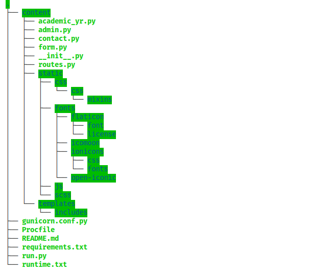

# Amazing Grace Montessori School WEBSITE
*This is a website for a school.*

## Installation
* First you have to get [Python](https://www.python.org/) installed on your computer.

* Create a new directory
* Open the directory in a terminal, then enter the command `git init .`
* Enter the command `git clone https://github.com/iSOLveIT/AGMS_website.git` in the terminal

* Install all dependencies in the requirements.txt file by using command `pip install -r requirements.txt`

## How to run the app
#### Using the Flask WSGI_server
* In order to run the app, open the directory in a terminal, then enter the command `python3 run.py` 

#### Using the Gunicorn_server
* To run the app, open the directory in a terminal, then enter the command `gunicorn -c gunicorn.conf.py run:app`

* NOTE: 
    * If you intend using this project in the productive environment do not use the development server.
    * Make sure debug=True is cleared in a productive environment

## What does the app achieve?
* The app is the website of a school. It gives the school an online presence.
* The app is used for online learning registration
* The app provides users with enough information about the school and how the school can be contacted

## How the app was designed?
* The app was designed with the Python web framework called Flask. 
* The app was designed as a package to make the code maintainable.
* The app uses the Flask MVT architecture by having a single file for holding both the views and routes (routes.py)

## Main Pages
* HOME ==> Welcome Page for website visitors
* E-LEARNING ==> Page for the distance learning education
* OUR SCHOOL ==> Give users information about the school
* ADMISSION ==> Page with information about admission
* GALLERY ===> Contains pictures of the school
* ACADEMICS ==> Page for academic purposes such as academice calendar, student portal, etc.
* CONTACT ==> Page with information about location, phone lines and contact forms of the unit

## Directory Structure

## Preview Link
[AGMS Website](http://agmschool.org)

## Author
* __Duodu Randy :octocat:__

### Date Created
* _Monday, 13th May, 2019_
